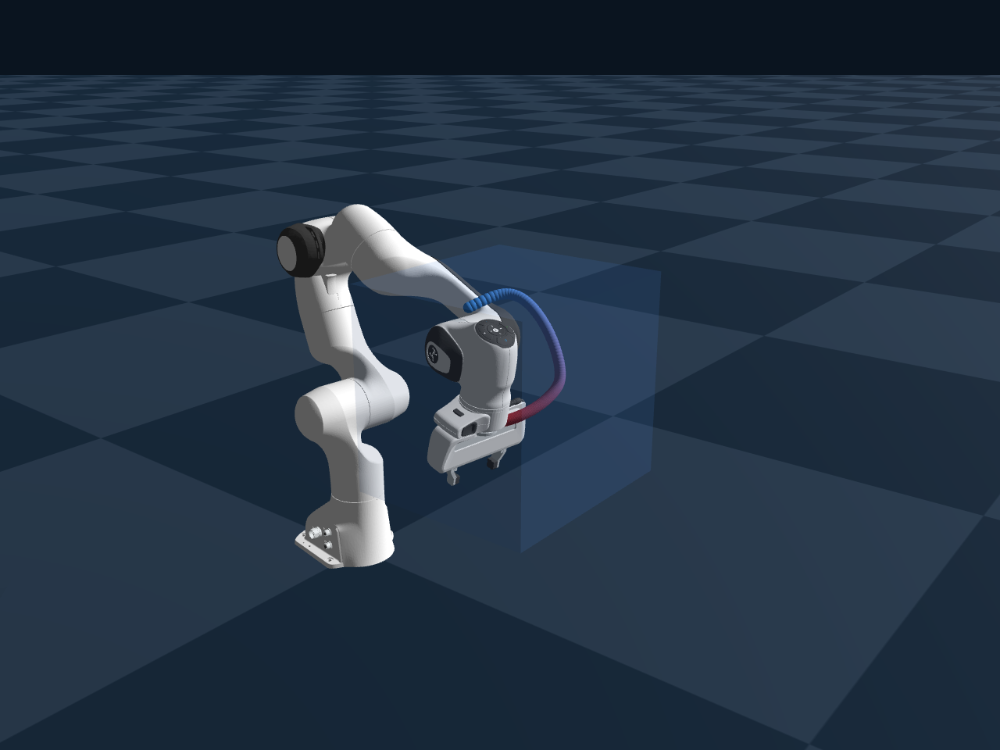
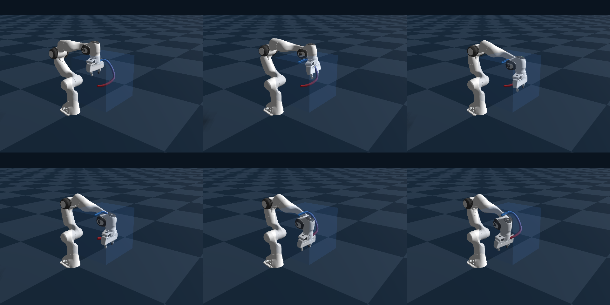

# Manipulator CBF-RL

面向机械臂的安全强化学习研究:在 GPU 并行仿真环境中,使用控制障碍函数(CBF)
对强化学习策略的输出动作进行实时安全滤波,保证机械臂始终处在解析的安全边界内,
并研究安全滤波对训练吞吐与收敛特性的影响。

## 效果展示

机械臂在解析安全边界(半透明蓝色方块)内跟踪随机平滑的 3D 参考轨迹,
蓝→红渐变球链为安全滤波后末端执行器的实际运动轨迹:

同一任务的一段动作序列(每 0.5 秒一帧,共 2.5 秒):

**性能对比**(256 个并行环境)

| 配置 | 端到端吞吐(相对) | 安全边界违例 | 单批滤波延迟 |
|---|---:|---:|---:|
| 无滤波 PPO(基线) | 100% | 0.4% | — |
| CBF + 完整 QP 求解 | 19.5% | 0% | 486 ms |
| CBF + 低秩近似(完整求解回退) | **78.8%** | **0%** | **9.5 ms** |

- 低秩近似的单批滤波延迟(256 环境/批)比完整求解低约 **51 倍**;
- 端到端吞吐保持为无滤波 PPO 的约 **80%**,同时把安全边界违例从 0.4% 降到 **0%**;
- 延迟数据来自共享轨迹基准(100 个控制周期、每周期 256 环境、3 次重复),
  吞吐数据为严格同种子(seed 7)短程对比。

---

本仓库仅用于项目效果展示,不公开源码与技术实现细节。
